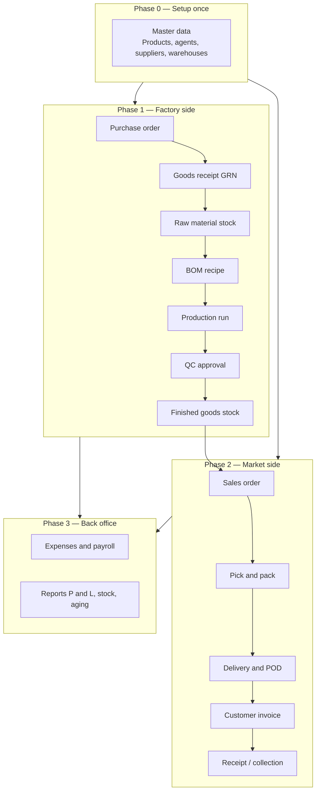
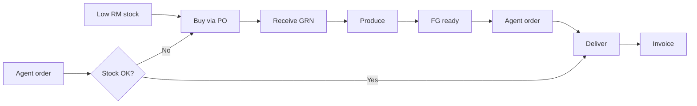
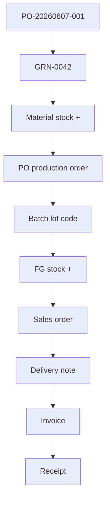
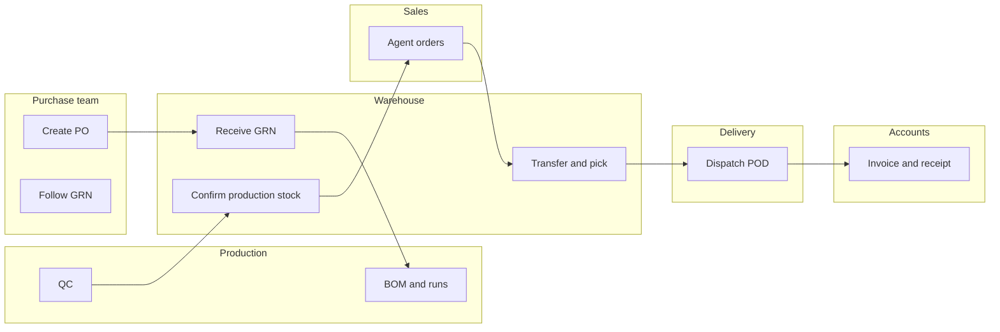
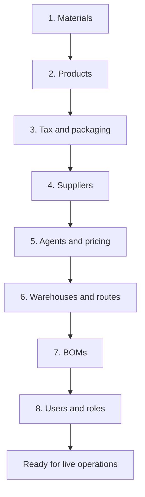

# How the whole Saf ERP system works

> **Who this is for:** Owners, managers, trainers, and anyone new to the system  
> **Read this first** — then open the module guide for the area you work in every day.

---

## One sentence summary

Saf ERP connects **buying materials → making products → storing stock → selling to agents → delivering → invoicing and collecting money** in one place, with every step tracked.

---

## The big picture

---

## Two entry points — same system

Most businesses run two cycles that meet in the **warehouse**:

| Entry point | Trigger | Path through the system |
|---|---|---|
| **Make stock first** | Low raw material or production plan | Procurement → Production → FG stock → Sales |
| **Sell first** | Agent places order | Sales order → check stock → maybe trigger production/procurement |

---

## Module map — what each area does

| # | Module | What it handles | Main output |
|---|---|---|---|
| 01 | Products & materials | Catalog of what you buy and sell | SKUs ready for BOM and sales |
| 02 | Agents & pricing | Who you sell to, commissions, price lists | Agent can place orders |
| 03 | Procurement | PO, GRN, supplier bills | Materials in stock, payables tracked |
| 04 | Warehouses & routes | Where stock lives, vehicles, delivery zones | Stock locations and dispatch plan |
| 05 | Manufacturing | BOM, batches, production, QC | Finished goods with batch traceability |
| 06 | Inventory | Stock levels, transfers, adjustments, MRP | Accurate quantities everywhere |
| 07 | Sales | Agent orders, targets, returns, gifts | Confirmed orders ready to ship |
| 08 | Delivery & POD | Dispatch, proof of delivery, exceptions | Goods delivered, stock consumed |
| 09 | Accounting | Invoices, receipts, expenses, payroll | Ledger and receivables updated |
| 10 | Reports | P&L, stock valuation, aging, production | Management decisions |

Each module has its **own guide** in `docs/modules/` with step-by-step instructions and flowcharts.

---

## Standard document flow (paper trail)

Every important action creates a **document** you can trace:

If a customer asks *“where did this carton come from?”* you can go **Invoice → Delivery → Sales order → Batch → Production run → GRN → PO**.

---

## Who does what (typical team)

| Role | Daily focus | Module guides to read |
|---|---|---|
| Admin | Master data, users, permissions | 01, 02, 04, Control sections |
| Purchase executive | PO and supplier follow-up | 03 |
| Production officer | Runs and batches | 05 |
| QC officer | Approve or reject batches | 05 |
| Warehouse officer | GRN, stock confirm, transfers, picking | 03, 05, 06, 08 |
| Sales officer | Agent orders | 07 |
| Delivery coordinator | Routes, POD, exceptions | 08 |
| Accounts officer | Invoices, bills, expenses | 09 |

---

## Setup order (first time only)

Do these **before** daily operations:

Skipping a step causes errors later (e.g. sales order without product, production without BOM).

---

## Daily rhythm (all teams)

| Time | Action | Where |
|---|---|---|
| Start of day | Check dashboard alerts and pending counts | Home dashboard |
| Morning | Clear GRN backlog, production QC, pending stock confirms | Procurement, Manufacturing |
| Midday | Process new sales orders, check stock | Sales, Inventory |
| Afternoon | Dispatch and update POD | Delivery |
| End of day | Post receipts, review open invoices | Accounting |
| Week end | Stock audit sample, open PO review | Inventory, Procurement |
| Month end | P&L, aging, payroll | Reports, Accounting |

---

## How stock moves (simple rules)

| Event | Material stock | Finished goods stock |
|---|---|---|
| GRN posted (approved QC) | **Increases** | — |
| Production stock confirmed | **Decreases** (BOM consumption) | **Increases** |
| Sales order confirmed | Reserved (not yet out) | Reserved |
| Delivery completed | — | **Decreases** |
| Stock transfer | Moves between warehouses | Moves between warehouses |
| Write-off / audit adjustment | Up or down per count | Up or down per count |

---

## Money flow (simple rules)

| Event | Accounts impact |
|---|---|
| Supplier bill posted | You owe supplier (payable) |
| Customer invoice from delivery | Agent owes you (receivable) |
| Receipt from agent | Receivable goes down, bank up |
| Expense posted | Expense up, bank or payable |
| Production completed | Cost of goods captured for P&L |

---

## When something goes wrong

| Problem | Usually means | Check module |
|---|---|---|
| Cannot confirm sales order | Not enough FG stock | 06 Inventory, 05 Manufacturing |
| Cannot confirm production stock | QC not done or no RM stock | 05 Manufacturing, 03 Procurement |
| GRN did not add stock | QC line not approved | 03 Procurement |
| No invoice for order | Delivery not marked delivered | 08 Delivery |
| Wrong VAT on invoice | Product tax class wrong | 01 Products |

See **Common problems** in `client-user-guide.md` for a longer list.

---

## Next steps

1. Read the **module guide** for your role (see table in `client-user-guide.md`).
2. Walk through **one full cycle** on a test order: PO → GRN → production → sales → delivery → invoice.
3. Use **Reports dashboard** weekly to verify numbers match reality.

---

## Related files

| Document | Purpose |
|---|---|
| `client-user-guide.md` | Index, roles, status codes, checklists |
| `modules/01` … `modules/10` | Detailed per-module manuals |
| `system-cycle.md` | Extended cycle notes for implementers |
