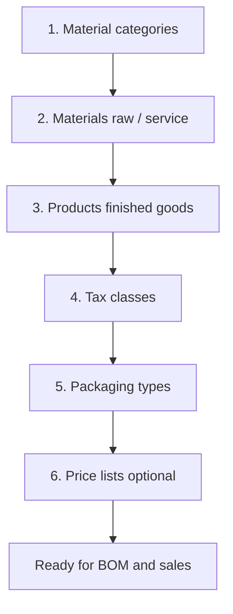

# Products and materials (master catalog)

> **Who this is for:** Admin, Production setup team, Purchase team  
> **What you achieve:** The system knows what you **buy** (materials), what you **sell** (products), and what each item costs.

---

## The idea in 30 seconds

Saf ERP splits items into two catalogs:

| Catalog | What it is | Examples | Used for |
|---|---|---|---|
| **Materials** | Things you buy or consume | PET bottles, caps, labels, RO water, factory labour (service) | Purchase orders, BOM components, stock consumption |
| **Products** | Things you sell to agents | 500ml carton, 1L carton, 20L jar | Sales orders, production output, finished-goods stock |

**Rule of thumb:** If it goes **into** the factory to make something → **Material**. If it goes **out** to a customer → **Product**.

---

## Setup order (do this first)

You cannot build a BOM until **materials** and **finished products** both exist.

---

## How to add a material (raw or service)

**Menu:** Control → Products → **Materials (raw / service)** → **Add material**  
**Screen:** `/admin/materials/create`

### Steps

1. Open **Materials** from the sidebar.
2. Click **Add material** (or go to Create).
3. Fill in the form (see table below).
4. Leave **Active** turned on.
5. Click **Save**.

**Result:** The material appears in purchase orders, BOM lines, and inventory (if stock-tracked).

### Field guide — materials

| Field | Required | What it means | Example |
|---|---|---|---|
| Material name | Yes | Name your team recognises | PET Bottle 500ml |
| Material type | Yes | **Raw** = physical stock. **Service** = labour/utilities (no stock qty). **In-house** = internal process step | Raw |
| Material code (SKU) | Yes | Unique code — never duplicate | RM-PET-500 |
| Unit of measure (UOM) | Recommended | How you count it | piece, liter, carton |
| Standard cost per unit | Recommended | Default cost for BOM and reports | 3.50 |
| Material category | Optional | Groups materials in lists | Packaging |
| Supplier name | Optional | Notes only — use Suppliers module for real POs | ABC Packaging |
| Active | Yes | Off = hidden from new POs/BOMs | On |

### Material type — when to use which

| Type | Stock tracked? | Typical use |
|---|---|---|
| Raw | Yes | Bottles, caps, cartons, water |
| Service | Usually no | Factory labour per day, utilities per shift |
| In-house | Depends | Internal processing steps |

---

## How to add a finished product

**Menu:** Control → Products → **Products** → **Add product**  
**Screen:** `/admin/products/create`

### Steps

1. Open **Products** from the sidebar.
2. Click **Add product**.
3. Enter name, SKU, base price, and tax class.
4. Set packaging type and size if applicable.
5. Click **Save**.

**Result:** The product can be sold on sales orders and selected as the **output** of a BOM and production run.

### Field guide — products

| Field | Required | What it means | Example |
|---|---|---|---|
| Product name | Yes | Sellable name | SAF Mineral Water 500ml Carton |
| SKU | Yes | Unique product code | SAF-500ML-CTN |
| Base price | Yes | Default selling price | 450.00 |
| Standard cost | Auto | Often copied from base price; used in margin reports | 380.00 |
| Tax / VAT class | Recommended | VAT rate on invoices | Standard 15% |
| Packaging type | Recommended | Carton, bottle, jar | Carton 12×500ml |
| Volume (ml) | Optional | Label and compliance | 6000 (12×500) |
| Active | Yes | Off = cannot sell | On |

---

## SKU naming tips

Keep codes short and consistent:

| Prefix | Meaning | Example |
|---|---|---|
| `RM-` | Raw material | RM-CAP-STD |
| `SV-` | Service | SV-LAB-FACT |
| `SAF-` | Finished product | SAF-500ML-CTN |

The system can suggest SKU patterns when you create items — follow your company standard.

---

## Real example — 500ml carton

**Materials you might create first:**

| SKU | Name | Type | UOM |
|---|---|---|---|
| RM-PET-500 | PET bottle 500ml | Raw | piece |
| RM-CAP-STD | Standard cap | Raw | piece |
| RM-LABEL-500 | Label 500ml | Raw | piece |
| RM-CARTON-12X500 | Carton holds 12 bottles | Raw | carton |
| RM-RO-WATER | RO water | Raw | liter |
| SV-LAB-FACT | Factory labour | Service | day |

**Product you create:**

| SKU | Name | Base price |
|---|---|---|
| SAF-500ML-CTN | 500ml water — carton of 12 | 450.00 |

Next step → **Module 05 Manufacturing**: build the BOM that links these materials to the product.

---

## Who can edit master data

| Action | Typical role |
|---|---|
| Add / edit materials | Admin, Control products permission |
| Add / edit products | Admin, Control products permission |
| Change prices | Admin or sales manager (price lists) |

---

## Common mistakes

- Creating a **product** when you mean a **material** (and vice versa) — BOM will not find the right items.
- Duplicate SKUs — the system blocks duplicates; pick a new code.
- Leaving **standard cost** empty on materials — BOM costing and production reports will show zero.
- Deactivating an item that is still on an active BOM — create a new BOM version instead.

---

## Related guides

- Module 05 — Manufacturing  
- Module 03 — Procurement  
