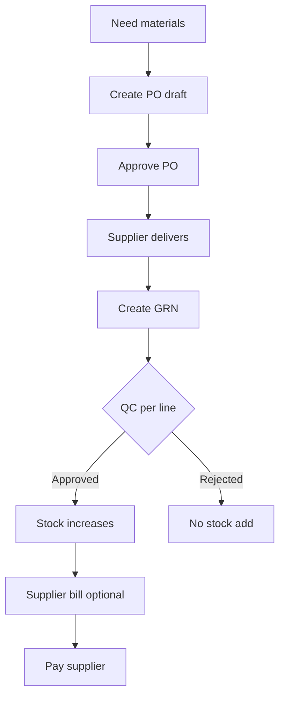

# Procurement — purchase orders, GRN, supplier bills

> **Who this is for:** Purchase executive, Warehouse officer, Accounts  
> **What you achieve:** Materials arrive, stock increases, and supplier payments are tracked.

---

## Before you start

- [ ] **Suppliers** created (Control → Suppliers)
- [ ] **Materials** in catalog (module 01)
- [ ] **Warehouse** for receiving (usually Factory or main store)

---

## Full procurement flow

---

## Step 1 — Create purchase order (PO)

**Menu:** Control → Suppliers → **Purchase orders** → Create  
**Screen:** `/admin/purchase-orders/create`

1. Choose supplier (registered or one-time vendor).
2. Set order date and expected delivery.
3. Add line items — pick **material** or custom description, qty, UOM, price.
4. Save — status is **Draft**.
5. **Approve** the PO when ready — only approved POs should be received.

| Status | Meaning |
|---|---|
| Draft | Being edited |
| Approved | Ready for goods receipt |
| Partial received | Some qty received via GRN |
| Received | Fully received |

---

## Step 2 — Receive goods (GRN)

**Menu:** Control → Suppliers → **GRN inbox** or Inventory → **Goods receipts**  
**Screen:** `/admin/goods-receipts`

**From PO (recommended):** Open approved PO → **Receive goods** — lines pre-filled.

1. Select warehouse and receipt date.
2. Enter **received quantity** per line (can be partial).
3. Set **QC status** per line — only **Approved** lines add to stock.
4. Submit GRN — goes to **pending approval** (warehouse + procurement sign-off on some setups).
5. After both approvals, stock posts for stock-tracked materials.

**Note:** Service lines (labour, utilities) confirm receipt but do not add stock quantity.

---

## Step 3 — Supplier bill and payment

**Menu:** Accounting → **Purchase bills**  
**Screen:** `/admin/bills`

1. Create bill linked to supplier and optionally PO/GRN.
2. Post payment when paid — tracks payables.

---

## Procurement inbox

Dashboard and PO index show counts for:

- POs **awaiting receipt**
- GRNs **pending approval**

Check these daily so materials are not stuck in limbo.

---

## Common mistakes

- Receiving against **draft** PO — approve first.
- GRN QC left pending — stock never increases.
- Receiving more than PO qty without note — causes reconciliation issues.

---

## Related guides

- [Products and materials](01-products-and-materials.md)
- [Manufacturing](05-manufacturing.md) — consumes materials received here
- [Inventory](06-inventory.md)
