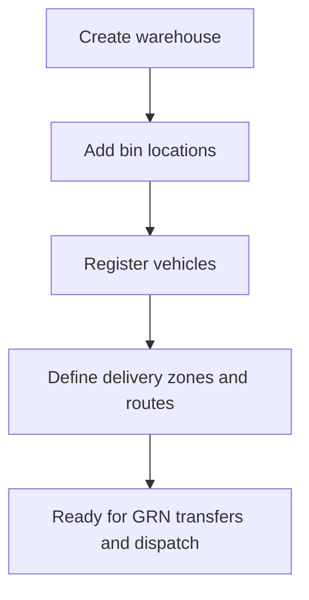

# Warehouses, locations, vehicles, and routes

> **Who this is for:** Admin, Warehouse manager, Delivery coordinator  
> **What you achieve:** Stock is stored in the right place and deliveries follow planned routes.

---

## Before you start

- [ ] Admin permission for Control → Warehouses

---

## Main setup flow

---

## Warehouses

**Menu:** Control → Warehouses → **Warehouses**  
**Screen:** `/admin/warehouses`

| Type | Typical use |
|---|---|
| Factory | Production and raw material store |
| Depot | Regional finished goods |
| Transit | Temporary (optional) |

Each warehouse holds **stock entries** per product (and batch for finished goods).

---

## Warehouse locations (bins)

**Menu:** Control → Warehouses → **Warehouse locations**  
**Screen:** `/admin/warehouse-locations`

Optional bin/shelf codes for picking accuracy.

---

## Vehicles

**Menu:** Control → Warehouses → **Vehicle registry**  
**Screen:** `/admin/vehicles`

Register trucks/vans used on deliveries. Linked when creating deliveries.

---

## Delivery zones and routes

**Menu:** Control → Warehouses → **Delivery zones & routes**  
**Screen:** `/admin/delivery-routes`

Map zones to agents or areas so dispatch can assign the right route and vehicle.

---

## Common mistakes

- All stock in one warehouse — transfers become messy; use Factory + depots.
- Missing factory warehouse — production confirm fails.
- User not granted warehouse access — they cannot see or post stock.

---

## Related guides

- [Inventory operations](06-inventory.md)
- [Delivery and POD](08-delivery-and-pod.md)
