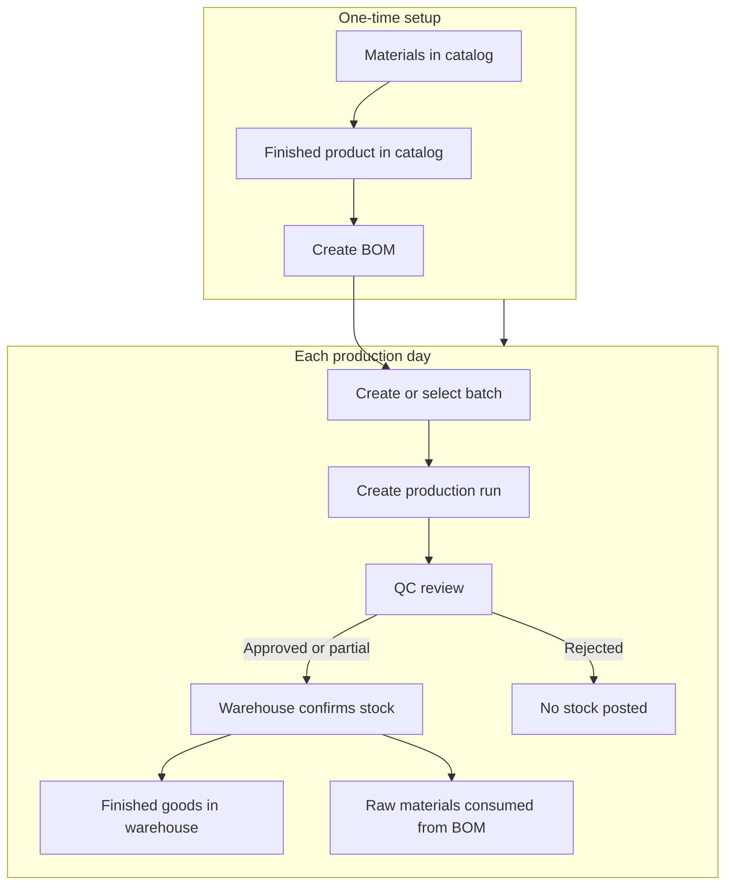
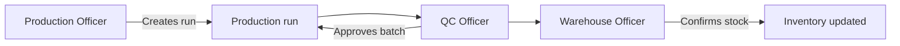

# Manufacturing — BOM, batches, production, QC, stock

> **Who this is for:** Production Officer, QC Officer, Warehouse Officer, Admin  
> **What you achieve:** Finished goods are made in the factory, checked by QC, and added to warehouse stock with a batch number for traceability.

---

## The idea in 30 seconds

Manufacturing in Saf ERP follows this chain:

1. **BOM** — recipe: “to make 1 carton, you need 12 bottles, 12 caps…”  
2. **Batch** — production lot with a code and expiry date  
3. **Production run** — today’s job: how many units, which line, which shift  
4. **QC review** — quality team approves, rejects, or partial pass  
5. **Confirm stock** — warehouse posts finished goods in and consumes materials from BOM  

---

## Full manufacturing flow

---

## Role flow — who does what

| Step | Who | Menu |
|---|---|---|
| Create BOM | Admin / Production lead | Manufacturing → BOMs |
| Create batch | Production | Manufacturing → Batches & lots |
| Create production run | Production | Manufacturing → Production orders & runs |
| QC review | QC Officer | Open run → QC review |
| Confirm stock | Warehouse Officer | Production → Pending receipts |

---

## Step 1 — Create a BOM (Bill of Materials)

**Menu:** Manufacturing → **BOMs** → Create  
**Screen:** `/admin/boms/create`

1. Select **finished product**.
2. Add **component lines** (material + qty per 1 finished unit + unit cost).
3. Mark **Active**.
4. Save.

See module **01 Products & materials** for material setup.

---

## Step 2 — Batch, production run, QC, confirm stock

| Step | Screen | Outcome |
|---|---|---|
| Batch | `/admin/batches` | Lot code + expiry |
| Production run | `/admin/production/create` | Run pending QC |
| QC review | Run detail page | Approved / partial / rejected |
| Confirm stock | `/admin/production/pending-receipts` | FG in, RM out per BOM |

---

## Common mistakes

- No active BOM — materials not consumed when stock confirmed.
- QC skipped — warehouse cannot confirm.
- Insufficient raw material stock — confirm fails; receive GRN first (module 03).

---

## Related guides

- Module 01 — Products and materials  
- Module 03 — Procurement  
- Module 06 — Inventory  
