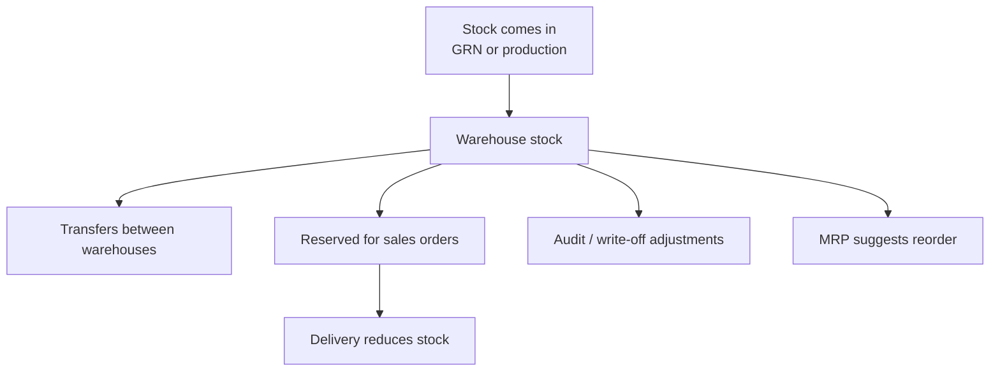

# Inventory operations

> **Who this is for:** Warehouse officer, Inventory controller  
> **What you achieve:** You always know how much stock you have, where it is, and can move or fix quantities safely.

---

## Main flow

---

## Key screens

| Task | Menu | Screen |
|---|---|---|
| View all stock | Inventory → Inventory dashboard | `/admin/inventory` |
| Material stock only | Inventory → Material stock | `/admin/inventory/materials` |
| Low stock alerts | Inventory → Low stock | `/admin/inventory/low-stock` |
| Reorder suggestions | Inventory → MRP suggestions | `/admin/mrp` |
| Move stock | Inventory → Transfers | `/admin/stock/transfers` |
| Fix quantity | Inventory → Inventory adjustments | `/admin/stock/audit` |
| Movement history | Inventory → Stock movements | `/admin/stock/movements` |

---

## Stock transfer

**Screen:** `/admin/stock/transfers`

1. Select **source** stock entry (warehouse + product + batch).
2. Select **destination** warehouse.
3. Enter quantity (cannot exceed available).
4. Save — stock moves without changing total company quantity.

---

## Stock audit (adjustment)

**Screen:** `/admin/stock/audit`

1. Select warehouse, product, optional batch.
2. System shows **system quantity**.
3. Enter **counted quantity**.
4. Post adjustment — variance is recorded.

Use after physical counts or to correct errors.

---

## Write-off

**Screen:** `/admin/stock/write-off`

Remove damaged or expired stock with a required reason.

---

## MRP (material requirements)

**Screen:** `/admin/mrp`

Suggests what to buy based on BOMs, open production, and reorder levels. Use with module 03 Procurement to create POs.

---

## Common mistakes

- Transferring more than available — system blocks; check material stock screen first.
- Auditing without selecting batch — wrong line adjusted for batch-tracked FG.
- Ignoring low stock — production and sales orders fail later.

---

## Related guides

- Module 03 — Procurement  
- Module 05 — Manufacturing  
- Module 07 — Sales  
