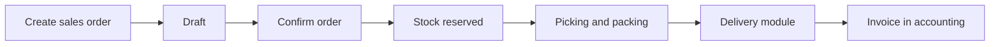

# Sales — orders, targets, returns, commissions

> **Who this is for:** Sales officer, Sales manager  
> **What you achieve:** Agent orders are captured, priced correctly, and ready for warehouse picking and delivery.

---

## Sales flow

---

## Create a sales order

**Menu:** Sales → **Sales orders** → New  
**Screen:** `/admin/orders/create`

1. Select **agent** — price list may auto-fill unit prices.
2. Set delivery date, payment mode, delivery address.
3. Add **line items** — finished products, qty, unit price.
4. Save — order starts as **draft** until confirmed.

### Order types

| Type | Meaning |
|---|---|
| Regular | Normal sale |
| Bulk | Large qty; may default to credit |
| Sample | Non-billable free issue |
| Return | Pickup authorization — does not reserve stock like a sale |

---

## Order status path

| Status | Meaning | Next step |
|---|---|---|
| Draft | Created | Confirm |
| Confirmed | Accepted | Pick / pack |
| Picked | Items picked | Pack |
| Packed | Ready to ship | Dispatch |
| Dispatched | On vehicle | Deliver |
| Delivered | Complete | Invoice |

---

## Sales targets

**Menu:** Sales → **Sales targets**  
**Screen:** `/admin/sales-targets`

Set monthly targets per agent or zone; compare in reports.

---

## Returns and gifts

| Screen | Use |
|---|---|
| `/admin/returns/customer` | Customer return orders |
| `/admin/gifts` | Promotional free goods |

---

## Commission

**Menu:** Sales → **Commission report** / **Commission settlements**  
**Screens:** `/admin/commissions`, `/admin/settlements`

Commission calculated from rules (module 02) and delivered/ invoiced orders.

---

## Common mistakes

- Confirming order without stock — system may block or show shortage; check inventory first.
- Wrong agent price list — verify unit prices before confirm.
- Sample order billed — use order type Sample.

---

## Related guides

- Module 02 — Agents and pricing  
- Module 06 — Inventory  
- Module 08 — Delivery and POD  
- Module 09 — Accounting  
