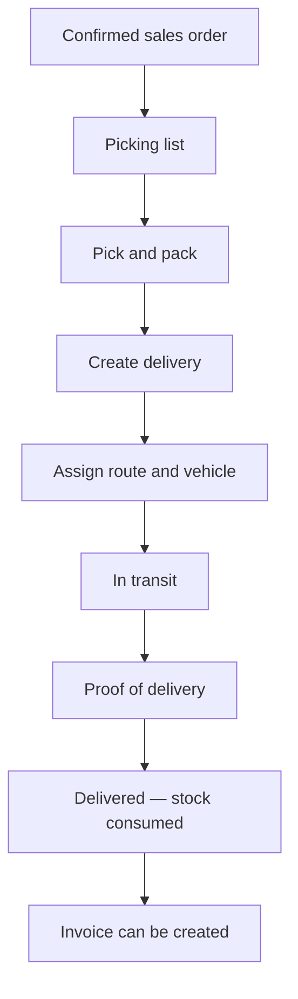

# Delivery, picking, and proof of delivery (POD)

> **Who this is for:** Delivery coordinator, Warehouse picker, Driver supervisor  
> **What you achieve:** Orders leave the warehouse, reach the agent, and POD is recorded for invoicing.

---

## Delivery flow

---

## Picking lists

**Menu:** Inventory → **Picking lists**  
**Screen:** `/admin/orders-picking`

View orders ready to pick. Open order picking list for line-by-line pick confirmation.

---

## Packing slips

**Menu:** Inventory → **Packing slips**  
**Screen:** `/admin/deliveries/packing-slips`

Print packing documents for warehouse.

---

## Create delivery

**Menu:** Inventory → **Deliveries & POD**  
**Screen:** `/admin/deliveries`

1. Link to **sales order**.
2. Assign **route**, **vehicle**, driver if used.
3. Set scheduled date.
4. Save — status **Scheduled**.

---

## Update POD (proof of delivery)

On delivery edit:

| Field | Purpose |
|---|---|
| Delivered quantity | What agent received |
| Short quantity | Less than ordered |
| Damaged quantity | Damaged in transit |
| Receiver name / phone | Who signed |
| Photo | Optional POD image |
| Exception note | If problem |

When status = **Delivered**, reserved stock is consumed and order can be invoiced.

---

## Vehicle loads

**Menu:** Inventory → **Vehicle loads**  
**Screen:** `/admin/vehicle-load`

Group multiple deliveries onto one vehicle trip.

---

## Exception handling

| Situation | What to record |
|---|---|
| Short delivery | Delivered qty + short qty |
| Damage | Damaged qty + note |
| Full reject | Exception note, zero delivered |

---

## Common mistakes

- Marking delivered without POD fields — disputes later with no record.
- Delivered qty greater than ordered — validation or invoice mismatch.
- Forgetting to mark delivered — invoice cannot be created (module 09).

---

## Related guides

- Module 07 — Sales  
- Module 04 — Warehouses and routes  
- Module 09 — Accounting  
