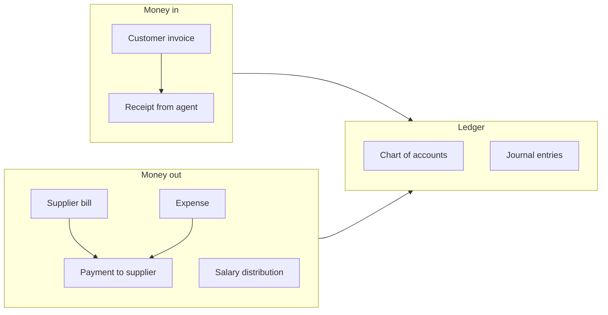

# Accounting — invoices, bills, expenses, payroll

> **Who this is for:** Accounts officer, Finance manager  
> **What you achieve:** Money in and out is recorded; agents and suppliers balances are correct.

---

## Money flow overview

---

## Customer invoices (receivables)

**Menu:** Accounting → **Customer invoices**  
**Screen:** `/admin/finance`

### Rules

- Invoice is normally created from a **delivered** sales order.
- **VAT** comes from product tax class.
- **Withholding** applied if agent has withholding rate (module 02).

### Post a receipt

1. Open invoice.
2. Enter amount, payment method, date.
3. Save — outstanding balance reduces.

**Outstanding** = (Net + VAT − Withholding) − Receipts

---

## Credit notes

Used for returns or adjustments. Credit amount cannot exceed remaining invoice value.

---

## Supplier bills (payables)

**Menu:** Accounting → **Purchase bills**  
**Screen:** `/admin/bills`

Record supplier invoices linked to PO/GRN. Post payments to clear payables.

---

## Expenses

**Menu:** Accounting → **Expenses**  
**Screen:** `/admin/expenses`

Day-to-day costs not tied to a PO (travel, utilities, etc.).

---

## Salary and payroll

| Screen | Use |
|---|---|
| `/admin/salary-distributions` | Pay employees |
| `/admin/expenses` | Allowances linked to HR |

Payroll summary in Reports.

---

## Chart of accounts and journals

| Screen | Use |
|---|---|
| `/admin/accounts` | Chart of accounts |
| `/admin/journals` | Manual journal entries |
| `/admin/accounting-periods` | Open/close periods |
| `/admin/finance/reconciliation` | Bank reconciliation |

---

## Agent advances

**Menu:** Accounting → **Agent advances**  
**Screen:** `/admin/agent-advances`

Track money advanced to agents; offset against collections.

---

## Common mistakes

- Invoicing before delivery — invoice should follow POD (module 08).
- Wrong tax class on product — VAT wrong on all invoices for that SKU.
- Receipt greater than outstanding — system should block overpayment.

---

## Related guides

- Module 07 — Sales  
- Module 03 — Procurement  
- Module 10 — Reports  
