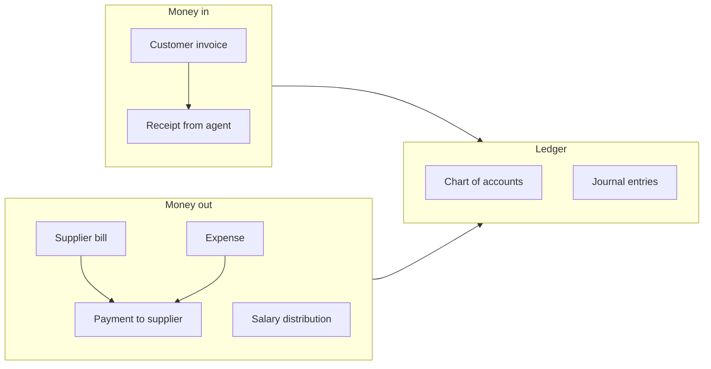

# Accounting — invoices, bills, expenses, payroll

> **Who this is for:** Accounts officer, Finance manager  
> **What you achieve:** Money in and out is recorded; agents and suppliers balances are correct.

---

## Money flow overview

Every finance document creates a **balanced journal entry**. See **[Transaction → ledger map](11-ledger-mapping.md)** for the full cheat sheet.

---

## Customer invoices (receivables)

**Menu:** Accounting → **Customer invoices**  
**Screen:** `/admin/finance`

### Rules

- Invoice is normally created from a **delivered** sales order.
- **VAT** comes from product tax class.
- **Withholding** applied if agent has withholding rate (module 02).

### GL posting

| Line | Account |
|---|---|
| Debit | Trade debtors (net + VAT) |
| Credit | Product sales (net) |
| Credit | VAT payable |
| Optional | WHT receivable / AR adjustment |

### Post a receipt

1. Open invoice.
2. Enter amount, payment method, date.
3. Save — **Dr Bank, Cr Trade debtors**.

**Outstanding** = (Net + VAT − Withholding) − Receipts − Credit notes − Advances applied

---

## Credit notes

Used for returns or adjustments. **Dr Sales returns (+ VAT), Cr Trade debtors.**

---

## Supplier bills (payables)

**Menu:** Accounting → **Purchase bills**  
**Screen:** `/admin/bills`

**Dr Purchases or GRNI + Input VAT | Cr Trade creditors.**  
Payment: **Dr Trade creditors | Cr Bank.**

---

## Expenses

**Menu:** Accounting → **Expenses**  
**Screen:** `/admin/expenses`

1. Pick **expense category** (maps to expense ledger).
2. Enter amount and date.
3. Choose **payment type:** bank, cash, or accrued (payable).

**Dr category expense | Cr bank/cash/payable**

Configure categories at **Expense category mapping** (`/admin/expense-categories`).

---

## Salary and payroll

| Screen | Use |
|---|---|
| `/admin/salary-distributions` | **Post payroll to GL** |
| `/admin/expenses` | One-off costs — not duplicate monthly payroll |

**Dr Salaries & wages | Cr bank/cash/salary payable**

See [HR & payroll](12-hr-payroll.md).

---

## Chart of accounts and journals

| Screen | Use |
|---|---|
| `/admin/accounts` | Chart of accounts — **Structure** and **Balances** tabs |
| `/admin/journals` | Manual journal entries |
| `/admin/accounting-periods` | Open/close periods |
| `/admin/finance/reconciliation` | Bank reconciliation |
| `/admin/expense-categories` | Category → ledger mapping |

---

## Agent advances

**Menu:** Accounting → **Agent advances**  
**Screen:** `/admin/agent-advances`

Give advance: **Dr Bank | Cr Agent advances.**  
Applied on invoice: **Dr Agent advances | Cr Trade debtors.**

---

## Commissions

Sales → Commission settlements. Accrual: **Dr Commission expense | Cr Commission payable.**  
Payment: **Dr Commission payable | Cr Bank.**

---

## Common mistakes

- Invoicing before delivery — invoice should follow POD (module 08).
- Wrong tax class on product — VAT wrong on all invoices for that SKU.
- Receipt greater than outstanding — system should block overpayment.
- Payroll in both Expenses and Salary distributions — **double P&L**.

---

## Related guides

- Module 07 — Sales  
- Module 03 — Procurement  
- Module 10 — Reports  
- Module 11 — Transaction → ledger map
