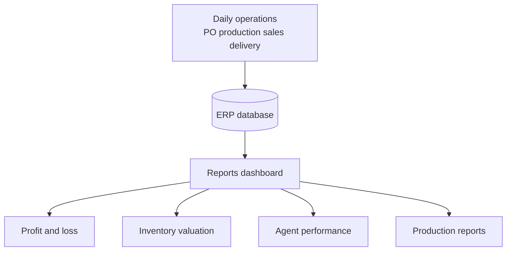

# Reports and analytics

> **Who this is for:** Management, Accounts, Operations leads  
> **What you achieve:** See performance, stock value, and financial position from live ERP data.

---

## How reports fit the system

Reports read **posted** transactions — if GRN, delivery, or receipt was not completed, numbers will be wrong.

---

## Reports dashboard

**Menu:** Reports & analytics → **Reports dashboard**  
**Screen:** `/admin/reports-dashboard`

Starting point for all standard reports.

---

## Financial reports

| Report | Screen | Use |
|---|---|---|
| Profit & loss | `/admin/reports/pl` | Revenue vs costs |
| Balance sheet | `/admin/reports/bs` | Assets and liabilities |
| Cash flow | `/admin/reports/cashflow` | Cash movement |
| Trial balance | `/admin/reports/trial-balance` | Account balances |
| General ledger | `/admin/reports/general-ledger` | Transaction detail |
| AR aging | `/admin/reports/ar-aging` | Who owes you |
| AP aging | `/admin/reports/ap-aging` | Who you owe |
| VAT report | `/admin/reports/vat` | Tax filing support |

---

## Operations reports

| Report | Screen | Use |
|---|---|---|
| Inventory valuation | `/admin/reports/inventory-valuation` | Stock value |
| Agent performance | `/admin/reports/agents` | Sales by agent |
| Production summary | `/admin/reports/production` | Output and cost |
| Production variance | `/admin/reports/production-variance` | Planned vs actual |
| Batch traceability | `/admin/reports/batch-trace` | Lot tracking |
| Payroll summary | `/admin/reports/payroll` | Salary totals |

---

## Export

**Menu:** Reports → **Export center**  
**Screen:** `/admin/export-center`

Export data for Excel or external tools. Tally export under Accounting → Tally export.

---

## Month-end report pack (recommended)

1. Inventory valuation  
2. AR and AP aging  
3. Profit & loss  
4. Production summary (if manufacturing)  
5. Agent performance  

---

## Common mistakes

- Running P&L before all deliveries invoiced — revenue understated.
- Inventory valuation with unaudited stock — numbers do not match warehouse count.
- Comparing reports from different date ranges without noting period.

---

## Related guides

- **How the whole system works** (document 00)  
- Module 09 — Accounting  
