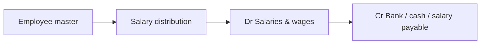

# HR & payroll

> **Who this is for:** HR admin, accounts officer  
> **What you achieve:** Employee records are maintained; payroll posts correctly to the ledger once.

---

## HR vs finance

| Screen | Purpose | Posts to GL? |
|---|---|---|
| Employees | Master data | No |
| Contracts | Employment terms | No |
| Leaves | Leave requests | No |
| Allowances | Allowance setup | No |
| **Salary distributions** | Pay employees | **Yes** |

---

## Payroll flow

1. Open **Accounting → Salary distributions** (`/admin/salary-distributions`).
2. Select employee, period, base salary + bonus + allowances.
3. Choose payment: bank, cash, or salary payable (accrued).
4. Save — system posts balanced payroll journal.

---

## Important rules

- Use **Salary distributions** for monthly payroll — do **not** also enter the same amount in **Expenses** (P&L would double-count).
- Employee **department** may appear as analytic label on journal lines.
- **Reports → Payroll summary** compares distributions to GL when journals are posted.

---

## Related guides

- [Accounting](09-accounting.md)
- [Transaction → ledger map](11-ledger-mapping.md)
